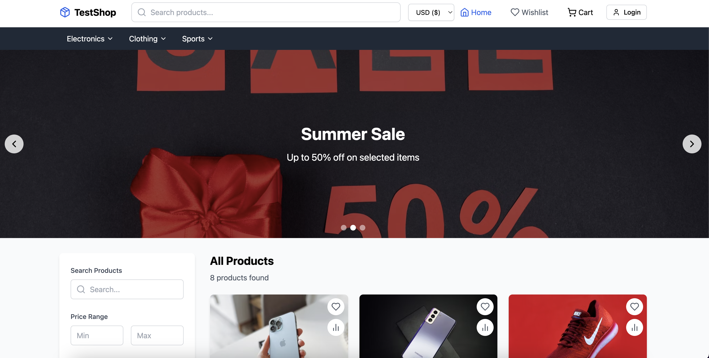

# TestShop - Modern E-commerce Platform

A full-featured e-commerce platform built with AI, React, TypeScript, and modern web technologies.



## Features

- 🛍️ Product browsing with categories and filters
- 🔍 Advanced search functionality
- 🛒 Shopping cart management
- 💖 Wishlist functionality
- ⚖️ Product comparison
- 👤 User authentication
- 📦 Order management
- 💳 Checkout process
- 💬 Product reviews
- 🌐 Multi-currency support

## Tech Stack

- **Frontend Framework:** React 18
- **Type System:** TypeScript
- **Styling:** Tailwind CSS
- **State Management:** Zustand
- **Routing:** React Router
- **Icons:** Lucide React
- **Database:** IndexedDB (via idb)
- **Build Tool:** Vite

## Getting Started

### Prerequisites

- Node.js (v18 or higher)
- npm or yarn

### Installation

1. Clone the repository:
```bash
git clone https://github.com/moatazeldebsy/testshop.git
cd testshop
```

2. Install dependencies:
```bash
npm install
```

3. Start the development server:
```bash
npm run dev
```

The application will be available at `http://localhost:5173`


## Development

### Available Scripts

- `npm run dev` - Start the development server
- `npm run build` - Build for production
- `npm run preview` - Preview production build
- `npm run lint` - Run ESLint

### Contributing

1. Fork the repository
2. Create your feature branch (`git checkout -b feature/AmazingFeature`)
3. Commit your changes (`git commit -m 'Add some AmazingFeature'`)
4. Push to the branch (`git push origin feature/AmazingFeature`)
5. Open a Pull Request

## License

This project is licensed under the MIT License - see the [LICENSE](LICENSE) file for details.

## Acknowledgments

- Product images from [Unsplash](https://unsplash.com)
- Icons from [Lucide](https://lucide.dev)
